# Description

    

This is an implementation of SigGraph 16' Paper, [Shrödinger's Smoke](http://page.math.tu-berlin.de/~chern/projects/SchrodingersSmoke/).

I do it for final project in Advances in Computer graphics lectured by Prof. Kun Zhou.

Below sections is sampled from my final report.

### Highlights

In the implementation, I implemented the incompressible Schrödinger fluid **(ISF)** algorithm described by the author, and completed the nozzle scene and LeapFrog scene.

In terms of performance, the author uses Houdini, 128^3^ subdivided mesh to solve ISF takes less than 1s, but I use Unity with Compute Shader to perform calculations on GPU, 512x128x128 subdivided mesh can solve ISF in about 200ms ,faster. When simulating particles, I used 400 million particles and finally simulated smoke at 1 fps. If you use Billboard technology with textures, you can use only tens of thousands of particles, and you can achieve real-time simulation (150 fps) on the GTX 1050 while reducing a certain sense of reality.

The highlights of my implementation is that the particle system, FFT calculation, and ISF solution are **all calculated on the GPU**, and the CPU is only responsible for sending parameters and random seeds. This is much faster than Author’s implementation even with an low end GPU & CPU.

### Results

#### 5.2.1 LeapFrog

| My Implementation                                            | Author’s Implementation                                      |
| ------------------------------------------------------------ | ------------------------------------------------------------ |
| 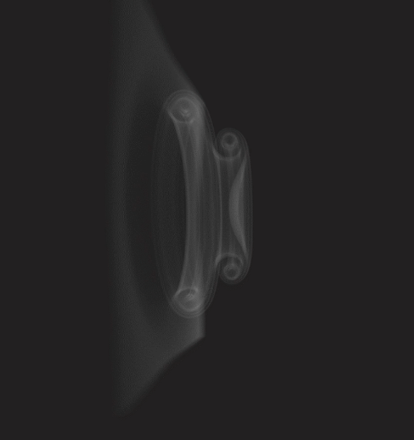 | 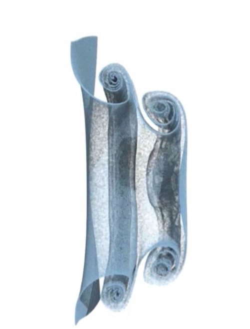 |
| 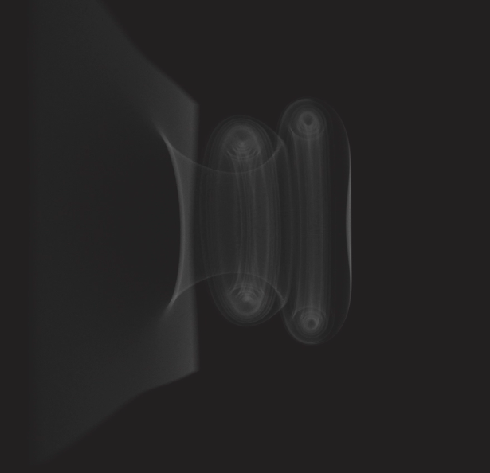 | 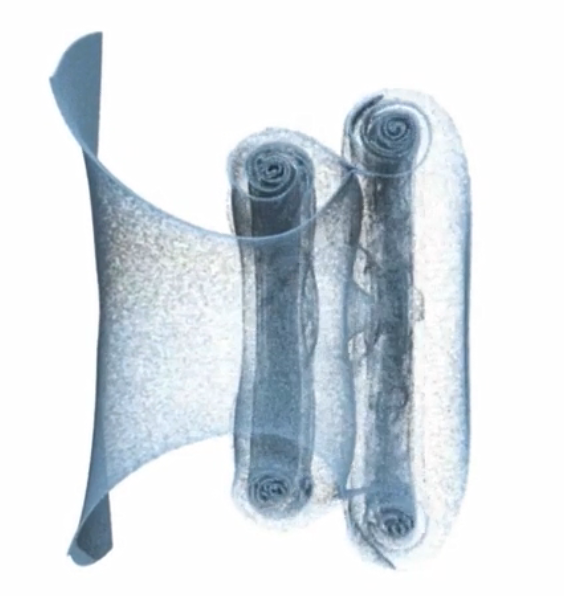 |
| 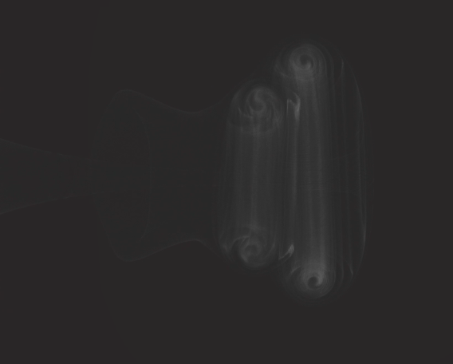 | 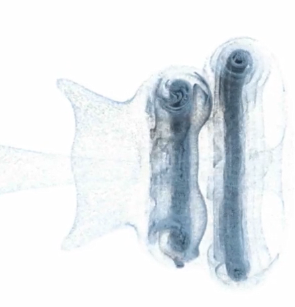 |
|                                                              |                                                              |

#### 5.2.2 Nozzle

My Implementation, before fine tuning:

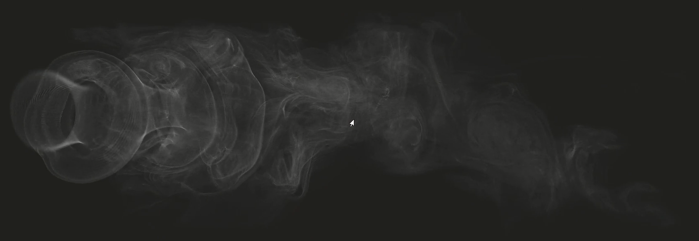

My Implementation, after fine tuning:

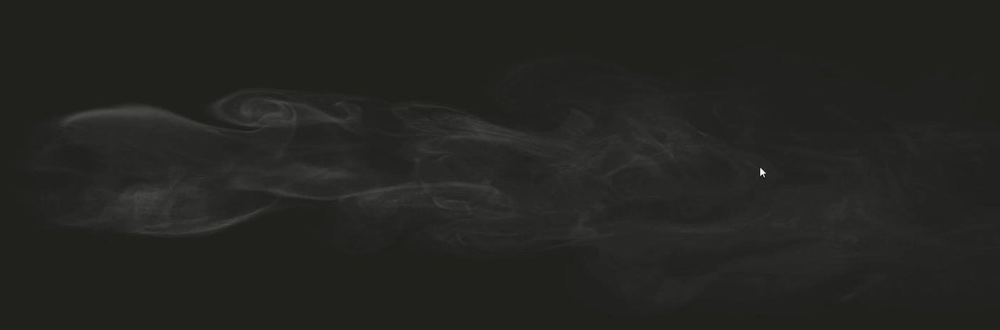

My implemetation:

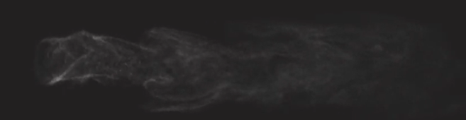

Author‘s  implementation:

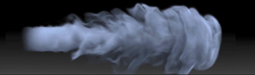

Different Parameters

 $\hbar=0.1$

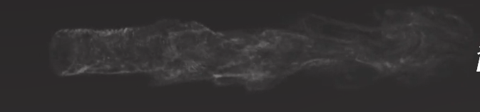

 $\hbar=0.05$

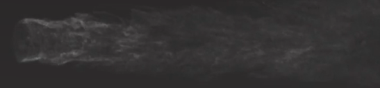

 $\hbar = 0.2$

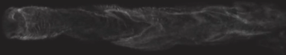

